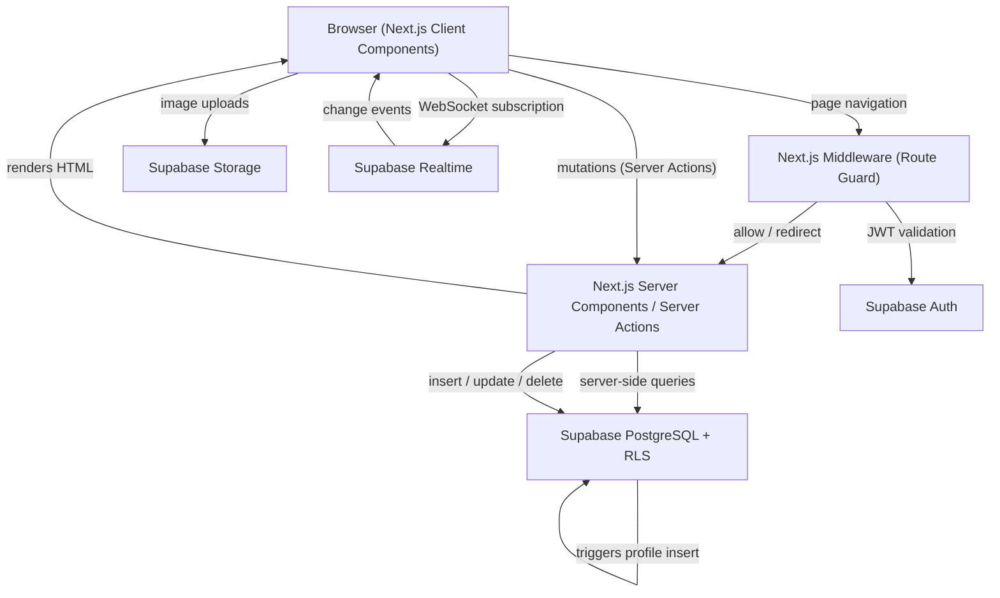

# Design Document

## Overview

HOMELY is a full-stack real estate web application built on **Next.js 14 (App Router)** with **Supabase** as the unified backend (PostgreSQL, Auth, Storage, Realtime). The platform serves three distinct roles — unauthenticated visitors, authenticated agents, and admins — each with progressively broader access to data and platform controls.

The architecture follows a **server-component-first** pattern: data fetching happens in React Server Components (RSCs) for initial page loads, while client components handle interactive state (filters, real-time subscriptions, form submissions). Supabase's Row Level Security (RLS) acts as the authoritative access-control layer, with Next.js Middleware providing a fast, early-exit guard for protected routes.

### Key Design Goals

- **Security by default**: RLS policies are the source of truth for data access; the frontend enforces the same rules for UX, not security.
- **Real-time without complexity**: Supabase Realtime channels are scoped narrowly (per-table, filtered) to minimise unnecessary re-renders.
- **Progressive enhancement**: Core browsing works without JavaScript (RSC-rendered); interactivity layers on top.
- **Minimal client bundle**: Server Actions replace API routes for mutations wherever possible.

---

## Architecture



### Request Lifecycle

1. **Navigation** — Next.js Middleware runs first, validates the Supabase session cookie, and redirects unauthenticated or unauthorised requests before any page code executes.
2. **Initial render** — Server Components fetch data directly from Supabase (using the server-side client with the service role or user JWT) and stream HTML to the browser.
3. **Interactivity** — Client Components hydrate and attach event handlers. Real-time subscriptions are established on mount.
4. **Mutations** — Forms invoke Next.js Server Actions, which run on the server with the user's JWT, so RLS is enforced automatically.
5. **Real-time** — The browser-side Supabase client maintains a WebSocket channel; incoming events trigger React state updates.

---

## Components and Interfaces

### Route Structure

```
app/
├── (public)/
│   ├── page.tsx                  # Home / hero + listings grid
│   ├── listings/
│   │   ├── page.tsx              # Filtered listings page
│   │   └── [id]/page.tsx         # Listing detail page
│   ├── about/page.tsx
│   └── services/page.tsx
├── (auth)/
│   ├── login/page.tsx
│   └── register/page.tsx
├── (protected)/
│   ├── profile/page.tsx          # User profile management
│   └── agent/
│       ├── listings/page.tsx     # Agent's own listings
│       ├── listings/new/page.tsx # Create listing form
│       └── listings/[id]/edit/page.tsx  # Edit listing form
├── admin/
│   ├── layout.tsx                # Admin shell with sidebar nav
│   ├── page.tsx                  # Analytics dashboard
│   ├── users/page.tsx            # User management grid
│   ├── properties/page.tsx       # Listing moderation grid
│   └── analytics/page.tsx        # Charts and stats
└── api/
    └── webhooks/                 # (reserved for future use)
```

### Key UI Components

| Component | Type | Responsibility |
|---|---|---|
| `<Navbar>` | Client | Brand logo, search input, nav links, auth state |
| `<HeroSearch>` | Client | Location / type / price filters, form submit → listings |
| `<PropertyGrid>` | Client | Paginated listing cards with real-time updates |
| `<PropertyCard>` | Client | Price, address, bed/bath/sqft, status badge |
| `<RecentSidebar>` | Server | Latest 5 listings ordered by `created_at` desc |
| `<ListingDetail>` | Server + Client | Full listing info, image gallery, real-time price |
| `<ListingForm>` | Client | Create/edit form with validation and image upload |
| `<ImageUploader>` | Client | Multi-file picker with type/size validation |
| `<ProfileForm>` | Client | Full name + avatar upload |
| `<AdminSidebar>` | Client | Navigation for admin sections |
| `<UserGrid>` | Client | Searchable, paginated profiles table |
| `<PropertyModerationGrid>` | Client | Searchable listings with approve/reject/archive actions |
| `<AnalyticsCards>` | Client | Summary stat cards with 60s auto-refresh |
| `<UserGrowthChart>` | Client | Line chart of registrations over time |

### Supabase Client Instances

Two Supabase client instances are used:

- **Browser client** (`createBrowserClient`): Used in Client Components for real-time subscriptions and image uploads. Operates under the authenticated user's JWT — RLS applies.
- **Server client** (`createServerClient`): Used in Server Components and Server Actions. Reads the session from cookies. RLS applies with the user's JWT.

### Server Actions

```typescript
// actions/listings.ts
export async function createListing(formData: FormData): Promise<ActionResult>
export async function updateListing(id: string, formData: FormData): Promise<ActionResult>
export async function deleteListing(id: string): Promise<ActionResult>

// actions/profile.ts
export async function updateProfile(formData: FormData): Promise<ActionResult>

// actions/admin.ts
export async function moderateListing(id: string, status: ModerationStatus): Promise<ActionResult>
export async function updateUserRole(userId: string, role: UserRole): Promise<ActionResult>
export async function banUser(userId: string): Promise<ActionResult>
export async function deleteUser(userId: string): Promise<ActionResult>
```

---

## Data Models

### TypeScript Types

```typescript
export type UserRole = 'user' | 'agent' | 'admin';
export type ListingStatus = 'available' | 'pending' | 'sold' | 'archived';
export type ModerationStatus = 'pending' | 'approved' | 'rejected';

export interface Profile {
  id: string;           // uuid, matches auth.users.id
  full_name: string | null;
  avatar_url: string | null;
  role: UserRole;
  created_at: string;   // ISO 8601
}

export interface Property {
  id: string;           // uuid
  agent_id: string;     // uuid → profiles.id
  title: string;
  description: string | null;
  price: number;
  address: string;
  bedrooms: number;
  bathrooms: number;
  sqft: number;
  images: string[];     // array of CDN URLs
  status: ListingStatus;
  moderation_status: ModerationStatus;
  created_at: string;   // ISO 8601
}

// Form input type (subset used for create/update)
export interface PropertyFormInput {
  title: string;
  description?: string;
  price: number;
  address: string;
  bedrooms: number;
  bathrooms: number;
  sqft: number;
  imageFiles?: File[];
}

// Filter state for the listings page
export interface ListingFilters {
  location?: string;
  propertyType?: string;
  minPrice?: number;
  maxPrice?: number;
  page: number;
  pageSize: number;
}

export type ActionResult =
  | { success: true; data?: unknown }
  | { success: false; error: string };
```

### Database Schema (Supabase SQL)

```sql
-- profiles table (mirrors auth.users)
create table profiles (
  id          uuid primary key references auth.users(id) on delete cascade,
  full_name   text,
  avatar_url  text,
  role        text not null default 'user' check (role in ('user', 'agent', 'admin')),
  created_at  timestamptz not null default now()
);

-- Auto-create profile on user sign-up
create or replace function handle_new_user()
returns trigger language plpgsql security definer as $$
begin
  insert into public.profiles (id, full_name, avatar_url, role)
  values (new.id, new.raw_user_meta_data->>'full_name', null, 'user');
  return new;
end;
$$;

create trigger on_auth_user_created
  after insert on auth.users
  for each row execute procedure handle_new_user();

-- properties table
create table properties (
  id                uuid primary key default gen_random_uuid(),
  agent_id          uuid not null references profiles(id) on delete cascade,
  title             text not null,
  description       text,
  price             numeric(12,2) not null,
  address           text not null,
  bedrooms          integer not null,
  bathrooms         integer not null,
  sqft              integer not null,
  images            text[] not null default '{}',
  status            text not null default 'available'
                      check (status in ('available', 'pending', 'sold', 'archived')),
  moderation_status text not null default 'pending'
                      check (moderation_status in ('pending', 'approved', 'rejected')),
  created_at        timestamptz not null default now()
);
```

### RLS Policies

```sql
-- Enable RLS
alter table profiles   enable row level security;
alter table properties enable row level security;

-- profiles: users can read/update their own row
create policy "profiles_select_own" on profiles
  for select using (auth.uid() = id);

create policy "profiles_update_own" on profiles
  for update using (auth.uid() = id);

-- profiles: admins have full access
create policy "profiles_admin_all" on profiles
  for all using (
    exists (select 1 from profiles where id = auth.uid() and role = 'admin')
  );

-- properties: public can read approved+available listings
create policy "properties_public_select" on properties
  for select using (status = 'available' and moderation_status = 'approved');

-- properties: agents can insert their own listings
create policy "properties_agent_insert" on properties
  for insert with check (agent_id = auth.uid());

-- properties: agents can update/delete their own listings
create policy "properties_agent_update" on properties
  for update using (agent_id = auth.uid());

create policy "properties_agent_delete" on properties
  for delete using (agent_id = auth.uid());

-- properties: admins have full access
create policy "properties_admin_all" on properties
  for all using (
    exists (select 1 from profiles where id = auth.uid() and role = 'admin')
  );
```

### Storage Buckets

| Bucket | Access | Max Size | Allowed Types |
|---|---|---|---|
| `avatars` | Authenticated read/write own folder | 5 MB | JPEG, PNG, WebP |
| `properties` | Public read, authenticated write | 10 MB | JPEG, PNG, WebP |

### Real-Time Channels

| Channel | Table | Filter | Events |
|---|---|---|---|
| `listings-public` | `properties` | `status=eq.available AND moderation_status=eq.approved` | INSERT, UPDATE, DELETE |
| `listing-{id}` | `properties` | `id=eq.{id}` | UPDATE |

---

## Correctness Properties

*A property is a characteristic or behavior that should hold true across all valid executions of a system — essentially, a formal statement about what the system should do. Properties serve as the bridge between human-readable specifications and machine-verifiable correctness guarantees.*

### Property 1: Public listing filter correctness

*For any* collection of property records with mixed `status` and `moderation_status` values, the public listings query should return only those records where `status = 'available'` AND `moderation_status = 'approved'`, and no others.

**Validates: Requirements 3.1, 11.2, 11.3**

---

### Property 2: Query filter composition

*For any* combination of active filters (location string, property type, min price, max price, name search term), the query builder function should produce a query object that includes the corresponding modifier for each active filter (`.ilike` for text search, `.eq` for type, `.gte`/`.lte` for price bounds), and omits modifiers for inactive filters.

**Validates: Requirements 3.2, 3.3, 3.4, 3.5, 10.2**

---

### Property 3: Recently added ordering invariant

*For any* collection of property listings, the recently-added query result should be ordered such that for every adjacent pair of listings `(a, b)`, `a.created_at >= b.created_at` (descending order is preserved).

**Validates: Requirements 3.7**

---

### Property 4: Listing creation sets correct defaults

*For any* valid listing form input submitted by an authenticated agent, the resulting insert payload should have `agent_id` equal to the authenticated user's `uid` and `moderation_status` equal to `'pending'`, regardless of what the form input contains.

**Validates: Requirements 4.1**

---

### Property 5: Uploaded image URLs are stored in listing

*For any* set of image URLs returned by the Storage_Service after upload, all of those URLs should appear in the `images` array of the resulting listing record — no URL should be silently dropped.

**Validates: Requirements 4.3**

---

### Property 6: Form validation rejects incomplete listings

*For any* listing form input where one or more required fields (`title`, `price`, `address`, `bedrooms`, `bathrooms`, `sqft`) are empty or missing, the validation function should return at least one error per missing field and the form should not be submitted to the database.

**Validates: Requirements 4.4**

---

### Property 7: File type validation rejects invalid formats

*For any* file whose MIME type is not one of `image/jpeg`, `image/png`, or `image/webp`, the frontend file validation function should return a type error and prevent the file from being submitted to the Storage_Service.

**Validates: Requirements 9.3**

---

### Property 8: File size validation rejects oversized files

*For any* file whose size in bytes exceeds 10,485,760 (10 MB), the frontend file validation function should return a size error and prevent the file from being submitted to the Storage_Service.

**Validates: Requirements 9.4**

---

### Property 9: Middleware enforces route authorization

*For any* HTTP request to a protected route (profile, agent routes, admin routes), the middleware should return a redirect or 403 response if the request's session does not satisfy the required role for that route — unauthenticated requests are always redirected to login, non-agent requests to agent routes are blocked, and non-admin requests to admin routes receive a 403.

**Validates: Requirements 2.4, 4.5, 10.6**

---

### Property 10: Realtime UPDATE handler applies new data

*For any* UPDATE event payload received from the Realtime channel, the listings state updater function should replace the listing in the array whose `id` matches the event's `id` with the new data from the event payload, leaving all other listings unchanged.

**Validates: Requirements 5.4, 5.5, 8.2**

---

### Property 11: Realtime INSERT handler adds new listing

*For any* INSERT event payload received from the Realtime channel where the listing has `moderation_status = 'approved'`, the listings state updater function should add the new listing to the array, resulting in an array length one greater than before.

**Validates: Requirements 8.3**

---

### Property 12: Realtime DELETE handler removes listing

*For any* DELETE event payload received from the Realtime channel, the listings state updater function should remove the listing whose `id` matches the event's `id` from the array, and the resulting array should not contain any listing with that `id`.

**Validates: Requirements 6.5, 8.4**

---

### Property 13: Analytics aggregation correctness

*For any* dataset of property records and profile records, the analytics aggregation functions should compute: total revenue as the exact sum of `price` for all records with `status = 'sold'`; active listing count as the exact count of records with `status = 'available'`; and total user count as the exact count of rows in `profiles`.

**Validates: Requirements 12.1**

---

### Property 14: Unauthenticated navbar shows Sign In

*For any* unauthenticated session state passed to the Navbar component, the rendered output should contain a "Sign In" link and should not contain a user profile link or avatar.

**Validates: Requirements 13.2**

---

### Property 15: Hero form encodes filters as URL query parameters

*For any* combination of filter values (location, property type, min price, max price) entered in the hero search form, submitting the form should produce a navigation URL to the listings page where each non-empty filter value appears as a correctly encoded query parameter.

**Validates: Requirements 13.7**

---

## Error Handling

### Authentication Errors

- **Invalid credentials**: Display a generic "Invalid email or password" message — never reveal which field is wrong (Requirement 1.5).
- **Duplicate email on registration**: Surface the Supabase Auth error as "An account with this email already exists."
- **Session expiry**: Middleware detects an expired JWT and redirects to `/login` with a `?reason=session_expired` query param so the login page can show a contextual message.
- **OAuth callback failure**: Catch errors in the OAuth callback route and redirect to `/login?reason=oauth_error`.

### Form Validation Errors

- All required-field errors are shown inline beneath the relevant input, not as a toast, so users can see exactly what needs fixing.
- Image validation errors (wrong type, too large) are shown immediately on file selection — before the form is submitted.
- Server Action errors (e.g., RLS rejection) are caught and returned as `ActionResult { success: false, error: string }` and displayed as a form-level error banner.

### RLS / Permission Errors

- If a Server Action receives a Supabase RLS error (code `42501`), it returns a user-friendly "You don't have permission to perform this action" message.
- The frontend never exposes raw Supabase error codes or SQL messages to the user.

### Real-Time Errors

- If the Realtime subscription fails to connect, the component falls back to polling every 30 seconds using `setInterval` + a standard Supabase query.
- Subscription errors are logged to the console in development; in production they are silently swallowed to avoid disrupting the UI.

### Storage Errors

- If an image upload fails mid-way through a multi-image upload, already-uploaded images are cleaned up (deleted from the bucket) before returning an error to the user.
- The listing is not inserted into the database until all image uploads succeed.

### Network / Unknown Errors

- All Server Actions wrap their logic in a `try/catch` and return `{ success: false, error: 'Something went wrong. Please try again.' }` for unexpected errors.
- A global error boundary (`error.tsx`) catches unhandled rendering errors and shows a friendly error page with a "Go back" link.

---

## Testing Strategy

### Overview

The testing strategy uses a **dual approach**: example-based unit tests for specific behaviors and edge cases, and property-based tests for universal invariants. Given that this is a Next.js + Supabase application, the majority of our own logic lives in:

1. **Query builder functions** (filter composition)
2. **Server Actions** (mutation logic, validation)
3. **Realtime event handlers** (state updaters)
4. **Middleware** (route authorization)
5. **Validation functions** (form and file validation)
6. **UI components** (rendering logic)

Property-based testing is appropriate here because many of these functions have clear input/output behavior and universal properties that hold across a wide input space (any filter combination, any file, any event payload, any session state).

### Property-Based Testing

**Library**: [fast-check](https://github.com/dubzzz/fast-check) (TypeScript-native, excellent Next.js compatibility)

**Configuration**: Each property test runs a minimum of **100 iterations**.

**Tag format**: `// Feature: homely-real-estate-app, Property {N}: {property_text}`

#### Property Tests to Implement

| Property | Function Under Test | Arbitraries |
|---|---|---|
| P1: Public listing filter | `buildPublicListingsQuery` | `fc.array(fc.record({ status, moderation_status, ... }))` |
| P2: Query filter composition | `buildListingsQuery(filters)` | `fc.record({ location?, propertyType?, minPrice?, maxPrice? })` |
| P3: Recently added ordering | `recentlyAddedQuery` result | `fc.array(fc.record({ created_at: fc.date() }))` |
| P4: Listing creation defaults | `buildInsertPayload(formInput, uid)` | `fc.record(PropertyFormInput)`, `fc.uuid()` |
| P5: Image URLs stored | `buildListingWithImages(urls)` | `fc.array(fc.webUrl())` |
| P6: Form validation rejects incomplete | `validateListingForm(input)` | `fc.record` with some fields set to empty string |
| P7: File type validation | `validateImageFile(file)` | `fc.record({ type: fc.string(), size: fc.nat() })` |
| P8: File size validation | `validateImageFile(file)` | `fc.record({ type: validMime, size: fc.nat() })` |
| P9: Middleware authorization | `middleware(request)` | `fc.record({ path: protectedPath, role: fc.option(UserRole) })` |
| P10: Realtime UPDATE handler | `applyRealtimeUpdate(listings, event)` | `fc.array(Property)`, `fc.record(UpdateEvent)` |
| P11: Realtime INSERT handler | `applyRealtimeInsert(listings, event)` | `fc.array(Property)`, `fc.record(InsertEvent)` |
| P12: Realtime DELETE handler | `applyRealtimeDelete(listings, event)` | `fc.array(Property)`, `fc.record(DeleteEvent)` |
| P13: Analytics aggregation | `computeAnalytics(properties, profiles)` | `fc.array(Property)`, `fc.array(Profile)` |
| P14: Unauthenticated navbar | `Navbar({ session: null })` | N/A (single example) → promote to EXAMPLE |
| P15: Hero form URL params | `buildListingsUrl(filters)` | `fc.record({ location?, propertyType?, minPrice?, maxPrice? })` |

### Unit / Example-Based Tests

**Library**: [Vitest](https://vitest.dev/) + [React Testing Library](https://testing-library.com/docs/react-testing-library/intro/)

Focus areas:
- `<Navbar>` renders correct elements for authenticated vs unauthenticated state
- `<ListingDetail>` renders all required fields from a mock listing
- `<ListingForm>` shows loading indicator and disables submit during submission
- `<UserGrid>` renders profiles data in a table
- `<UserGrowthChart>` renders with time-series data
- Analytics refresh interval is ≤ 60 seconds
- Realtime subscription is established on mount and cleaned up on unmount

### Integration Tests

Run against a local Supabase instance (via `supabase start`):

- User registration creates a profile row with `role = 'user'`
- Login establishes a session; logout clears it
- RLS: agent cannot update/delete another agent's listing
- RLS: unauthenticated user cannot insert a listing
- RLS: admin can read/write all rows
- Image upload to `properties` bucket returns a public CDN URL
- Moderation: approved listing appears in public query; rejected listing does not
- Ban user: profile updated, session revoked

### Test File Structure

```
__tests__/
├── unit/
│   ├── components/
│   │   ├── Navbar.test.tsx
│   │   ├── ListingDetail.test.tsx
│   │   ├── ListingForm.test.tsx
│   │   └── AnalyticsCards.test.tsx
│   └── lib/
│       ├── queryBuilder.test.ts
│       ├── validation.test.ts
│       └── realtimeHandlers.test.ts
├── property/
│   ├── queryBuilder.property.test.ts   # P1, P2, P3, P15
│   ├── listingActions.property.test.ts # P4, P5, P6
│   ├── fileValidation.property.test.ts # P7, P8
│   ├── middleware.property.test.ts     # P9
│   ├── realtimeHandlers.property.test.ts # P10, P11, P12
│   └── analytics.property.test.ts     # P13
└── integration/
    ├── auth.integration.test.ts
    ├── rls.integration.test.ts
    └── storage.integration.test.ts
```
